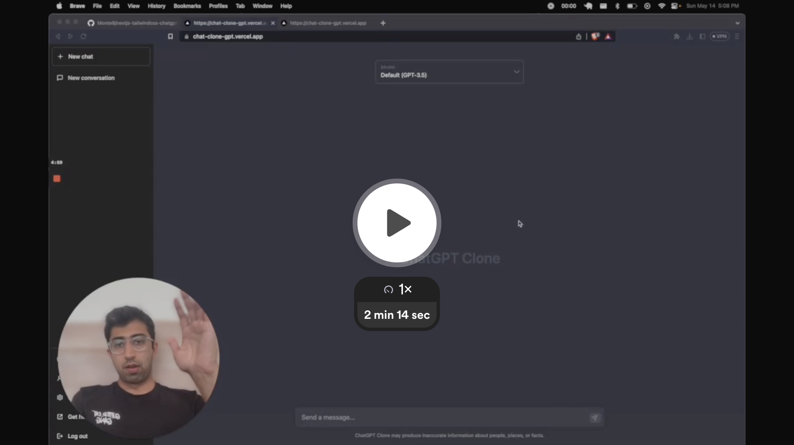

# prisma-gpt

[](#)
[](#)
[](#)

A ChatGPT clone web application with a clean, dark-themed chat interface. Despite the name, this project does **not** use Prisma ORM -- it is a conversational AI interface built with Next.js that proxies requests to the OpenAI API.



## Features

- **Multi-model support** -- select between GPT-3.5 Turbo, GPT-4 Turbo, and GPT-4 from a dropdown menu
- **Markdown rendering** -- full Markdown support in responses with syntax-highlighted code blocks and a copy-to-clipboard button
- **Dark-themed UI** -- ChatGPT-like interface with sidebar navigation for managing conversations
- **Responsive design** -- mobile-friendly layout with a collapsible sidebar
- **Analytics** -- Mixpanel integration for usage tracking
- **Auto-resizing textarea** -- input area grows dynamically as you type

## Architecture

The application uses the **Next.js 13 Pages Router** with a server-side API route (`/api/openai`) that proxies requests to the OpenAI API. There is no database -- conversations are ephemeral and exist only in the client's React state. The API route implements a context window management strategy, sending the first 3 and last 5 messages of a conversation to keep requests within token limits.

## Tech Stack

| Layer       | Technology                              |
| ----------- | --------------------------------------- |
| Language    | TypeScript 5                            |
| Framework   | Next.js 13 (Pages Router)              |
| UI          | React 18, Tailwind CSS 3               |
| AI          | OpenAI SDK v3                           |
| Markdown    | react-markdown, react-syntax-highlighter|
| Analytics   | Mixpanel                                |
| HTTP Client | Axios                                   |

## Getting Started

### Prerequisites

- Node.js 16+
- Yarn
- An [OpenAI API key](https://platform.openai.com/api-keys)

### Installation

1. Clone the repository:

   ```bash
   git clone https://github.com/ryanviana/prisma-gpt.git
   cd prisma-gpt
   ```

2. Install dependencies:

   ```bash
   yarn
   ```

3. Create a `.env` file in the project root and add your OpenAI API key:

   ```
   OPENAI_API_KEY=sk-your-key-here
   ```

4. Start the development server:

   ```bash
   yarn dev
   ```

5. Open [http://localhost:3000](http://localhost:3000) in your browser.

### Production Build

```bash
yarn build
yarn start
```

## License

This project is provided as-is with no explicit license.
